# Command Chef: Sistema de Gerenciamento de Restaurante CLI

Este é um sistema de gerenciamento de restaurante baseado em linha de comando (CLI) desenvolvido em Python. 

O **Command Chef** permite cadastrar clientes, pratos, gerenciar pedidos, e até mesmo interagir com um ChatBot inteligente para dúvidas sobre o menu e fila dos pedidos.

## Integrantes do Grupo

| Nome Completo | RA |
| ---------------------- | ------ |
| Matheus Gomes Pedroza | 1998912 |
| Rayssa Gomides Marconato | 2001130 |
| Rodrigo Garcia Bassalobre | 2007642 |

## Requisitos de Execução

Para executar o Command Chef, siga os passos abaixo:

1.  **Clone o repositório:**
    ```bash
    git clone https://github.com/RayssaGM21/ComandChef.git
    cd ComandChef
    ```
    
2.  **Instale as dependências:**
    ```bash
    pip install -r requirements.txt
    ```
    
3.  **Configuração da API Key do Google Gemini (para o ChatChefBot):**
 
     O ChatChefBot utiliza a API do Google Gemini. Você precisará de uma chave de API para que ele funcione.

      > **Atenção:** Nunca exponha sua chave de API publicamente!
    
    ---

    #### No Windows:

    * **Temporário (apenas para a sessão atual do terminal):**

      Abra o Prompt de Comando (CMD) ou PowerShell e digite:
      ```cmd
      :: No CMD
      set GOOGLE_API_KEY=SUA_CHAVE_AQUI
      ````
      ```bash
      # Ou no PowerShell:
      $env:GOOGLE_API_KEY="SUA_CHAVE_AQUI"
      ```

    * **Permanente:**
      1.  Pesquise por "Variáveis de Ambiente" no menu Iniciar.
      2.  Clique em "Editar as variáveis de ambiente do sistema".
      3.  Na janela "Propriedades do Sistema", clique em "Variáveis de Ambiente...".
      4.  Na seção "Variáveis de usuário para [seu_usuário]", clique em "Nova...".
      5.  No campo "Nome da variável", digite `GOOGLE_API_KEY`.
      6.  No campo "Valor da variável", cole sua chave de API.
      7.  Clique em OK em todas as janelas. **Você precisará reiniciar seu terminal** para que a variável seja reconhecida.
  
    ---
  
    #### No macOS / Linux:
  
    * **Temporário (apenas para a sessão atual do terminal):**

      Abra o terminal e digite:
      ```bash
      export GOOGLE_API_KEY="SUA_CHAVE_AQUI"
      ```
  
    * **Permanente:**
      1.  Abra seu arquivo de perfil do shell (geralmente `~/.bashrc`, `~/.zshrc` ou `~/.profile`) em um editor de texto.
      2.  Adicione a seguinte linha no final do arquivo:
          ```bash
          export GOOGLE_API_KEY="SUA_CHAVE_AQUI"
          ```
      3.  **Salve e feche** o arquivo.
      4.  **Recarregue o perfil** (`source ~/.bashrc`, por exemplo) ou **reinicie seu terminal** para que as mudanças tenham efeito.

    ---
  
    **Lembre-se de substituir `SUA_CHAVE_AQUI` pela sua chave de API real do Google.**
    ### Como gerar sua chave de API no Google AI Studio?
      - Acesse [**https://aistudio.google.com/**](https://aistudio.google.com/).
      - Faça login com sua conta Google.
      - No canto superior esquerdo, você verá um menu. Clique em "**Get API key**".
      - Crie uma nova chave de API. Copie-a imediatamente, pois ela só será mostrada uma vez.
  
  5.  **Execute o sistema:**

    python main.py


## Conheça o CommandChef

O Command Chef é um sistema CLI interativo que simula as operações essenciais de um restaurante. Ele foi projetado para ser intuitivo e fácil de usar, permitindo o gerenciamento de clientes, o cardápio de pratos e o fluxo de pedidos.

**Principais Funcionalidades:**

* **Cadastro de Clientes:** Permite adicionar novos clientes ao sistema, registrando seus nomes e gerando IDs únicos automaticamente.
* **Cadastro de Pratos:** Possibilita a inclusão de novos pratos no menu, com nome, preço e uma lista de ingredientes.
* **Listagem de Clientes e Pratos:** Exibe de forma organizada os clientes e pratos cadastrados em formato de tabela.
* **Fazer Pedidos:** Permite que um cliente selecione múltiplos pratos do menu, criando um pedido com cálculo automático do valor total. Os pedidos são adicionados a uma fila de processamento.
* **Retirar Pedidos:** Simula a entrega do próximo pedido na fila, removendo-o da espera.
* **Remover Pratos:** Permite a remoção de itens do cardápio.
* **Ver Fila de Pedidos:** Exibe todos os pedidos atualmente na fila, mostrando o cliente, os pratos e o valor total.
* **Gerenciamento de Promoções:** Um sub-menu dedicado para adicionar, remover e listar promoções especiais para os pratos, usando uma estrutura de dados de Lista Encadeada.
* **ChatChefBot:** Um chatbot integrado que utiliza a API do Google Gemini para responder a perguntas sobre o menu (pratos, ingredientes, preços) e a fila de pedidos, proporcionando uma experiência de atendimento ao cliente simulada.

## Escolha das Estruturas de Dados

Durante o desenvolvimento do Command Chef, diversas estruturas de dados foram aplicadas estrategicamente para otimizar o armazenamento e manipulação das informações:

* **Listas (Pilhas e Filas):**
    * **Listas comuns:** Utilizadas para armazenar coleções de `clientes` e `pratos` (`dados.py`). A escolha de listas é natural para armazenar conjuntos de itens que podem ser iterados e acessados por índice, além de facilitar a adição e remoção.
    * **Fila (`collections.deque`):** A `fila_pedidos` é implementada com `deque`, uma estrutura otimizada para operações de adicionar e remover em ambas as extremidades. Isso é essencial para um sistema de pedidos, onde o primeiro pedido a ser feito deve ser o primeiro a ser processado (FIFO - First-In, First-Out).
    * **Pilha** histórico de pedidos visitados recentemente (pedidos_visitados_recentemente) é implementado usando uma lista comum do Python, mas operando como uma pilha (LIFO - Last-In, First-Out).

* **Tuplas:**
    * Os `ingredientes` de cada `Prato` são armazenados como tuplas. A natureza imutável das tuplas é ideal para dados que não devem ser alterados após a criação, como a composição de um prato. Isso garante a integridade dos dados e pode oferecer pequenas otimizações de performance e segurança.

* **Sets:**
    * Durante o cadastro de um prato, os ingredientes são coletados em um `set` temporariamente. Isso garante que cada ingrediente seja único e evita duplicatas na lista de ingredientes do prato, antes de ser convertido para uma tupla para armazenamento final. Sets são eficientes para verificar a existência de elementos e garantir unicidade.

* **Dicionários:**
    * `clientes` e `pratos` são armazenados como listas de dicionários. Cada dicionário representa uma entidade (cliente ou prato) e suas propriedades (nome, preço, etc.) são acessadas por chaves. Dicionários oferecem acesso rápido aos dados por chave e são flexíveis para representar objetos com atributos nomeados. Os métodos `to_dict()` nas classes `Cliente` e `Pedido` reforçam essa representação estruturada.

* **Listas Encadeadas (simples):**
    * A `pratos_em_promocao` é gerenciada por uma `LinkedList` personalizada. A Lista Encadeada foi escolhida para demonstrar o conhecimento de uma estrutura de dados fundamental, onde os elementos são conectados por referências (ponteiros). Para promoções, isso é útil devido a necessidade de inserções/remoções frequentes de uma lista em constante mudança, sem o custo de realocação de memória de uma lista dinâmica baseada em array.

## Fluxograma

